<div align="center">

# DSA House

### The ultimate interactive platform to master Data Structures & Algorithms

**Structured Roadmaps · Step-by-Step Visualizers · Multi-Algo Performance Race · Recursion Call Stack Trace · Graph & Tree Debuggers · Bitwise Sandbox · Coding Arena · Quizzes**

[](https://nextjs.org/)
[](https://react.dev/)
[](https://www.typescriptlang.org/)
[](https://tailwindcss.com/)
[](https://github.com/pmndrs/zustand)
[](https://supabase.com/)
[](./LICENSE)
[](#)

<a href="https://dsa-house.vercel.app">Live Demo</a> ·
<a href="https://github.com/Tanvir284/Dsa-house">Repository</a> ·
<a href="#-getting-started">Quick Start</a> ·
<a href="#-core-feature-showcase">Top Features</a>

</div>

---

## 📖 Overview

**DSA House** is a full-stack, production-ready computer science learning laboratory designed to turn complex data structures and algorithmic concepts into highly engaging, interactive, and gamified workflows.

Built using **Next.js 16 (App Router) + React 19 + Tailwind v4 + Zustand**, the application is engineered around an **offline-first architecture**. If no cloud sync variables are provided, the entire platform gracefully falls back to a locally persisted state storage, allowing students to study, test, compile, and visualize entirely offline.

---

## 🚀 Core Feature Showcase (Top 10 Highlights)

Here is a curated look at the ten most valuable interactive modules built into DSA House:

### 1. Interactive Learning Roadmap
An algorithmic roadmap node tree that provides a guided pathway for learners, indicating prerequisites, topics, and completed sections.
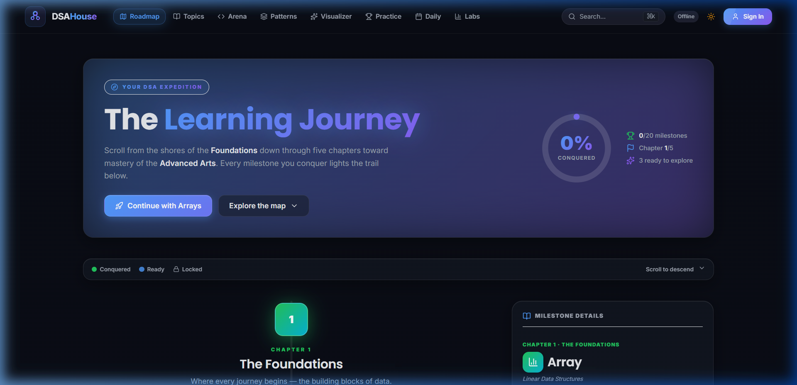

---

### 2. Gamified Progress Dashboard
A full dashboard featuring streak systems, XP meters, completed curriculum tracks, quiz history log, and pinned topic bookmarks to maintain learning momentum.
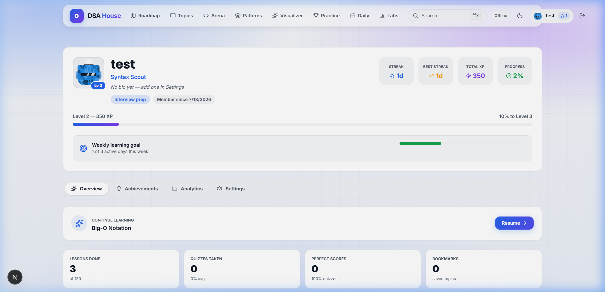

---

### 3. LeetCode-Style Coding Arena
An integrated IDE-like coding workspace equipped with structured problem descriptions, multi-language solutions (C++, Python, JS), constraints, and complexity analysis tabs.
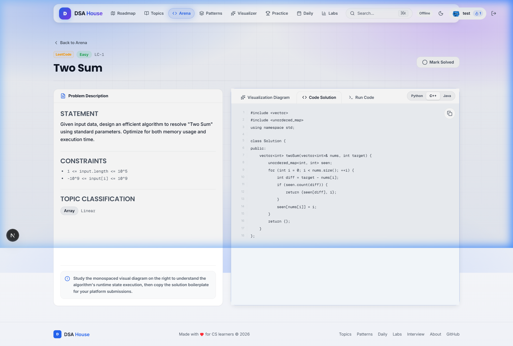

---

### 4. Sorting Performance Race Track
A multi-algorithmic sandbox where Bubble, Insertion, Merge, and Quick Sort run side-by-side on custom arrays, generating instant swap, comparison, and execution time statistics.
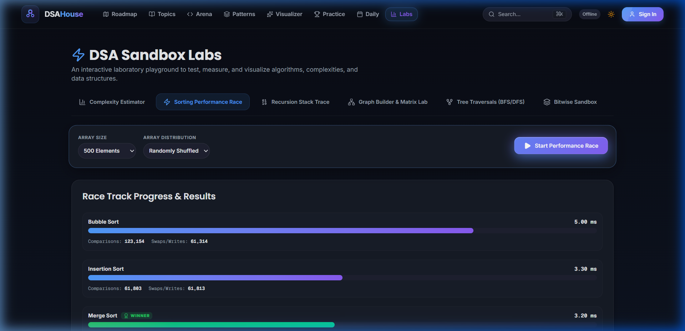

---

### 5. Recursion Call Stack Trace
A debugger that models recursive processes (e.g., Fibonacci, Factorials) by building a dynamic call hierarchy tree, illustrating live push/pop call stack changes step-by-step.
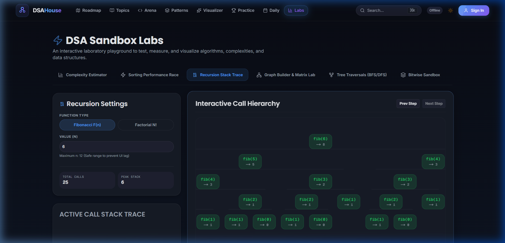

---

### 6. Graph Builder & Matrix Lab
A graph visualization interface mapping vertices and edges dynamically to adjacency matrices and lists in real-time.
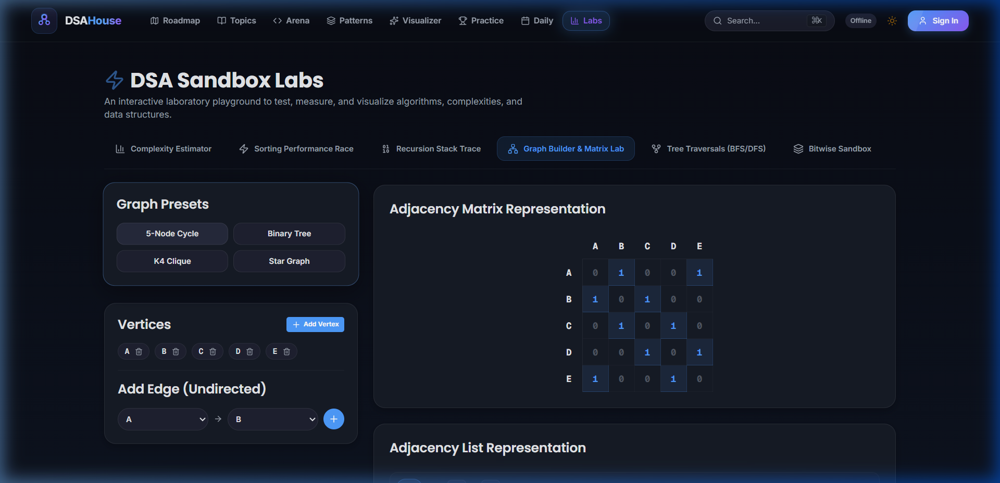

---

### 7. Tree Traversals Simulator (BFS vs DFS)
An interactive queue/stack step debugger demonstrating Breadth-First and Depth-First (Pre, In, Post) traversals with visual node illumination.
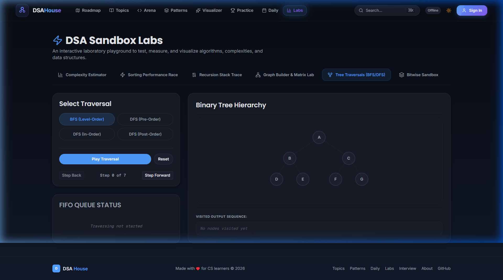

---

### 8. Bitwise Operations Sandbox
An 8-bit registers interface allowing interactive bit toggling with instant decimal updates, binary readouts, logical operations, and bit shift simulations.
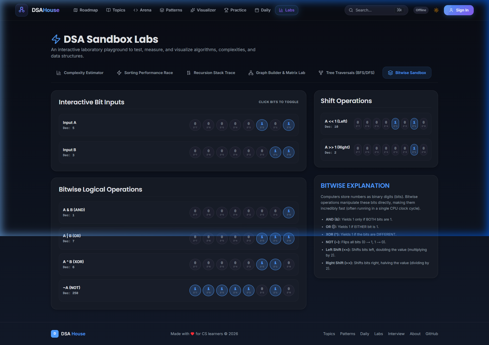

---

### 9. Step-by-Step Algorithm Visualizers
Hand-built step-playback engines for Sorting and Pointer-based Data Structures (Linked Lists, BSTs, Stacks, Queues) with speed control.
| Array Sorting Visualizer | Linked List Visualizer |
| --- | --- |
| 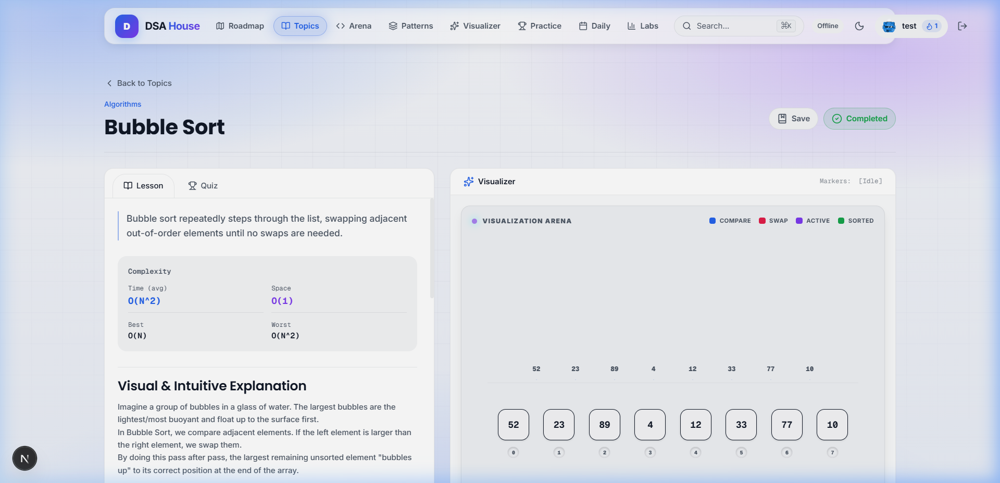 | 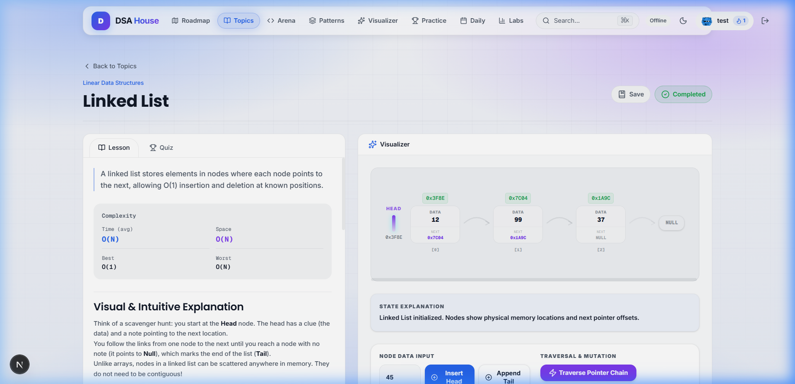 |

---

### 10. Interactive Quizzes & Assessment Engine
A topic-based MCQ/True-False exam engine providing real-time feedback, detailed explanation drawers, XP awards, and confetti celebrations.
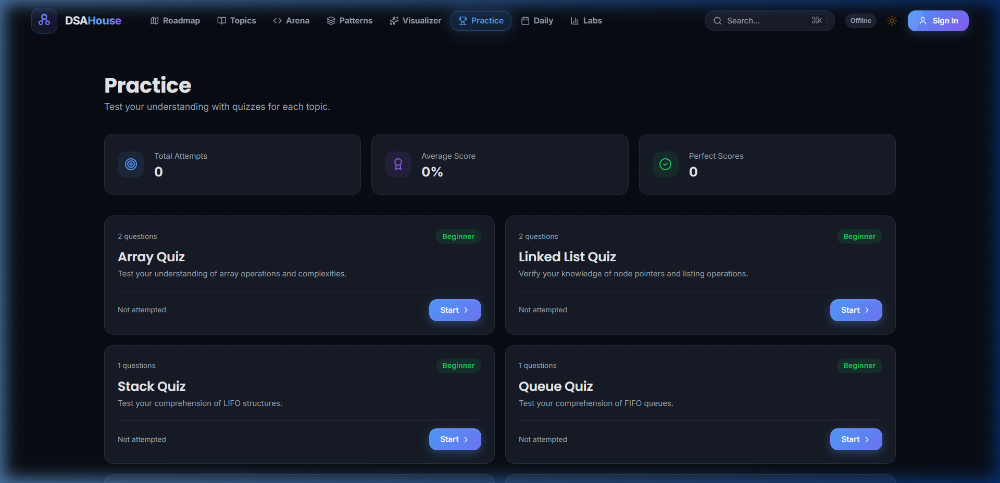

---

## 🛠️ Technical Stack & Architecture

### Frontend & Rendering
- **Next.js 16 (App Router):** Leveraging Server Components, optimized image pipelines, and Turbopack bundler.
- **React 19:** Utilizing Suspense boundaries, state batching, and lightweight React runtime.
- **Tailwind CSS v4:** Modern styling system with variables defined in `globals.css`.
- **Framer Motion:** Powering clean transitions, visualizer canvas shifts, and card expansions.
- **KaTeX:** High-speed recursive LaTeX typesetting engine for Big-O notation.

### Data & State Management
- **Zustand Store:** Structured client state store backed by custom LocalStorage sync drivers for seamless offline usage.
- **Supabase Integrations:** Postgres database schema + RLS (Row Level Security) + anonymous user registration to handle user progress backups in the cloud.

---

## 📁 Project Structure

```
DSA House/
├── assets/
│   └── screenshots/          # Top 10 high-resolution feature screenshots
├── public/                   # Static content & brand assets
├── src/
│   ├── app/                  # Next.js App Router folders & pages
│   │   ├── labs/             # Estimator, Sorting Race, Recursion, Graph, Traversals, Bitwise
│   │   ├── roadmap/          # Clickable visual learning roadmap
│   │   ├── topics/           # Curriculum topics and lesson cards
│   │   ├── visualizer/       # Step-playback visualizer sandboxes
│   │   ├── practice/         # Interactive quizzes catalogue & layout
│   │   ├── problems/         # Coding problem workspace
│   │   └── dashboard/        # XP tracker & bookmarks panel
│   ├── components/
│   │   ├── layout/           # Shared Navbar, Footer, and Store bootstrappers
│   │   ├── visualizers/      # Custom algorithmic canvas blocks
│   │   └── MarkdownRenderer.tsx
│   ├── lib/                  # Zustand stores, Auth API, and Supabase client
│   └── types/                # Strict TypeScript interfaces
└── supabase/
    └── schema.sql            # Database schema & security policies
```

---

## 🏁 Getting Started

### 1. Installation
Ensure you have **Node.js 18.17+** installed, then run:
```bash
git clone https://github.com/Tanvir284/Dsa-house.git
cd Dsa-house
npm install
```

### 2. Set Up Environment Variables (Optional)
DSA House operates perfectly out-of-the-box in **Offline Mode**. To connect cloud storage:
```bash
cp .env.example .env.local
```
Add your Supabase details to `.env.local`:
```env
NEXT_PUBLIC_SUPABASE_URL=your-supabase-url
NEXT_PUBLIC_SUPABASE_ANON_KEY=your-anon-key
```

### 3. Run Development Server
```bash
npm run dev
```
Open **[http://localhost:3000](http://localhost:3000)** in your browser.

---

## ⚖️ License
This project is licensed under the [MIT License](./LICENSE).

---

## 👨‍💻 Developer & Author
**Md Tanvir Islam**
- GitHub: [@Tanvir284](https://github.com/Tanvir284)
- Live App: [dsa-house.vercel.app](https://dsa-house.vercel.app)

If this platform helps you crush your technical interviews, please drop a ⭐ on the repository!
