<div align="center">

# DSA House

### An interactive platform for learning data structures & algorithms — and the engineering behind it, laid open

**150 topics · 16 algorithm visualizers · 600 coding problems · Timed mock interviews · Offline-first**

[](./.github/workflows/ci.yml)
[](https://nextjs.org/)
[](https://react.dev/)
[](https://www.typescriptlang.org/)
[](https://tailwindcss.com/)
[](https://vitest.dev/)
[](./LICENSE)

<a href="https://dsa-house.vercel.app"><strong>Live Demo</strong></a> ·
<a href="#getting-started">Quick Start</a> ·
<a href="#architecture">Architecture</a> ·
<a href="#feature-tour">Feature Tour</a> ·
<a href="./docs/ARCHITECTURE.md">Full Design Notes</a>

</div>

---

## Table of Contents

1. [Overview](#overview)
2. [Architecture](#architecture)
   - [System Overview](#system-overview)
   - [The Tracer Engine](#the-tracer-engine)
   - [Data Layer: Catalog vs. Content](#data-layer-catalog-vs-content)
   - [State & Persistence](#state--persistence)
   - [Testing Strategy](#testing-strategy)
   - [Performance Budget](#performance-budget)
   - [Accessibility](#accessibility)
   - [CI/CD](#cicd)
3. [Feature Tour](#feature-tour)
4. [Tech Stack](#tech-stack)
5. [Project Structure](#project-structure)
6. [Getting Started](#getting-started)
7. [License & Author](#license--author)

---

## Overview

DSA House is a full-stack learning platform for data structures and
algorithms: a structured 150-topic curriculum, 16 step-through algorithm
visualizers, a LeetCode-style coding arena with real in-browser code
execution, and a timed mock-interview mode with a rubric report.

It's built with **Next.js 16 (App Router) + React 19 + Tailwind v4 +
Zustand**, and engineered **offline-first** — without Supabase credentials
configured, the entire app runs on `localStorage` for progress, XP, and
session state, so it's fully usable with zero backend setup.

This README isn't a feature brochure. It's written so that a reader with no
prior context on the codebase can trace *why* it's shaped the way it is —
where the interesting engineering decisions live, what trade-offs they made,
and what broke along the way. The [Architecture](#architecture) section below
is the substance; [Feature Tour](#feature-tour) is the proof it works.

---

## Architecture

### System Overview

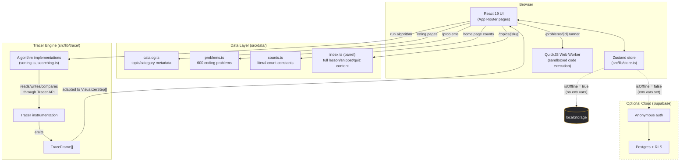
```mermaid
flowchart TB
    subgraph Client["Browser"]
        UI["React 19 UI<br/>(App Router pages)"]
        Store["Zustand store<br/>(src/lib/store.ts)"]
        Worker["QuickJS Web Worker<br/>(sandboxed code execution)"]
    end

    subgraph Data["Data Layer (src/data/)"]
        Catalog["catalog.ts<br/>topic/category metadata"]
        Problems["problems.ts<br/>600 coding problems"]
        Counts["counts.ts<br/>literal count constants"]
        Barrel["index.ts (barrel)<br/>full lesson/snippet/quiz content"]
    end

    subgraph Trace["Tracer Engine (src/lib/trace/)"]
        Algo["Algorithm implementations<br/>(sorting.ts, searching.ts)"]
        Tracer["Tracer instrumentation"]
        Frames["TraceFrame[]"]
    end

    subgraph Backend["Optional Cloud (Supabase)"]
        Auth["Anonymous auth"]
        PG["Postgres + RLS"]
    end

    UI -->|"listing pages"| Catalog
    UI -->|"/problems"| Problems
    UI -->|"home page counts"| Counts
    UI -->|"/topics/[slug]"| Barrel
    UI -->|"run algorithm"| Algo
    Algo -->|"reads/writes/compares<br/>through Tracer API"| Tracer
    Tracer -->|"emits"| Frames
    Frames -->|"adapted to VisualizerStep[]"| UI
    UI <--> Store
    Store -.->|"isOffline = true<br/>(no env vars)"| LocalStorage[("localStorage")]
    Store -.->|"isOffline = false<br/>(env vars set)"| Auth
    Auth --> PG
    UI -->|"/problems/[id] runner"| Worker

    style LocalStorage fill:#2a2a2e,stroke:#f0b429,color:#f4f4f3
    style Backend stroke-dasharray: 5 5
```

The app runs entirely client-side against `localStorage` by default (the
dashed **Optional Cloud** box only activates when
`NEXT_PUBLIC_SUPABASE_URL`/`NEXT_PUBLIC_SUPABASE_ANON_KEY` are set) — see
[State & Persistence](#state--persistence). The **Data Layer** is split into
light and heavy modules specifically to keep pages that only list or link
content from paying for content they never render — see
[Data Layer](#data-layer-catalog-vs-content). The **Tracer Engine** is the
part of this codebase most worth reading closely — it's covered in depth next.

---

### The Tracer Engine

**The problem.** Every algorithm visualizer needs two things: the algorithm's
actual logic, and a step-by-step narration of what it's doing for a learner to
follow. The obvious way to build that is to write both — the algorithm, and a
parallel sequence of `steps.push({ elements, highlights, explanation })` calls
describing it. That's what this codebase originally did, and it's a trap:
the algorithm and its narration are two things a person has to keep in
agreement *by hand*, forever. The original test suite for this
(`tests/dsa-logic.test.js`, since deleted) made the risk concrete — it
asserted against a **third**, independently hand-ported copy of each
algorithm, so it could pass while the actual shipped visualizer disagreed with
the actual shipped algorithm.

**The approach.** `src/lib/trace/` replaces that pattern with a small
instrumentation layer. An algorithm is written **once**, as ordinary readable
code, against a narrow `Tracer` API:

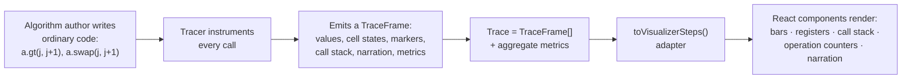
```mermaid
flowchart LR
    A["Algorithm author writes<br/>ordinary code:<br/>a.gt(j, j+1), a.swap(j, j+1)"] --> B["Tracer instruments<br/>every call"]
    B --> C["Emits a TraceFrame:<br/>values, cell states, markers,<br/>call stack, narration, metrics"]
    C --> D["Trace = TraceFrame[]<br/>+ aggregate metrics"]
    D --> E["toVisualizerSteps()<br/>adapter"]
    E --> F["React components render:<br/>bars · registers · call stack ·<br/>operation counters · narration"]
```

```ts
// src/lib/trace/algorithms/sorting.ts — this is the whole algorithm.
// There is no second copy anywhere that describes what it does.
run(t, input) {
  const a = t.array(input);
  for (let i = 0; i < a.length - 1; i++) {
    for (let j = 0; j < a.length - i - 1; j++) {
      if (a.gt(j, j + 1)) a.swap(j, j + 1);
    }
    a.seal(a.length - i - 1);
  }
  return a.snapshot();
}
```

`a.gt(j, j+1)` both performs the comparison the algorithm actually needs
**and** emits a frame recording it, with narration generated from the
operation itself (`"Compare a[j] (12) with a[j+1] (7) — 12 > 7."`). The
visualization is a **byproduct of actually running the algorithm** — it
cannot disagree with what the algorithm did, because it's derived from doing
it, not asserted alongside it.

This bought three things beyond correctness:

- **Real complexity data.** `TraceMetrics` (comparisons, swaps, reads, writes)
  are incremented by the instrumentation itself, not asserted by the
  algorithm author. The "Work Done" panel on every visualizer page and the
  empirical complexity comparisons in the test suite (e.g. *"merge sort does
  fewer comparisons than bubble sort at n=40"*) are **measured**, not claimed.
- **A recursion call stack for free.** `enter()`/`exit()` around recursive
  calls (merge sort, quick sort) produce a real, live call-stack panel —
  something a step-array-of-objects design has no natural way to represent.
- **Ten visualizers from four.** Selection, insertion, heap, and shell sort,
  plus linear and jump search, were each ~30–80 lines once the tracer existed
  to write them against — versus ~115 lines average for each of the original
  four hand-written generators.

**Verification.** `tests/tracer.test.ts` asserts invariants that hold for
*every* algorithm in the registry, not per-algorithm — adding a new algorithm
subjects it to the whole battery automatically, with no per-algorithm test
file to remember to write:

| Invariant | What it catches |
|---|---|
| Output is a permutation of the input | An algorithm that drops or invents a value |
| Every swap is a true transposition | "Two cells changed" being mistaken for a real swap |
| A cell marked `sorted` never changes again | An algorithm sealing a cell optimistically |
| A cell marked `discarded` is never touched again | A search that doesn't actually narrow correctly |
| No frame contains a value absent from the input | An algorithm inventing data |
| Metrics only increase | A miscounted operation |
| Adaptive sorts do less work on sorted input | `adaptive: true` being a decorative label instead of a real property |

These invariants caught **three real bugs during development**, not
retrospectively: heap sort briefly mislabelled as adaptive, insertion and
shell sort marking a prefix `sorted` when a later key could still move it, and
an early version of the frame-budget guard silently corrupting the computed
result instead of only truncating the recording. A fourth bug — binary/jump
search losing the "this half is ruled out" visual cue the pre-tracer code had
— was caught in a later code-review pass and fixed by adding a `discard()`
primitive to the tracer, backed by its own permanence invariant.

**Where the seam is.** `toVisualizerSteps()` adapts a `Trace` to the legacy
`VisualizerStep` shape the existing renderers consume. This is deliberate —
it let the tracer replace the old generator layer without also requiring a
rewrite of every visualizer component in the same change. A new surface that
wants the richer data (call stack, metrics, named markers) should read
`TraceFrame` directly rather than going through the adapter, which drops that
structure down to `{ elements, highlights, markers, explanation, status }`.

---

### Data Layer: Catalog vs. Content

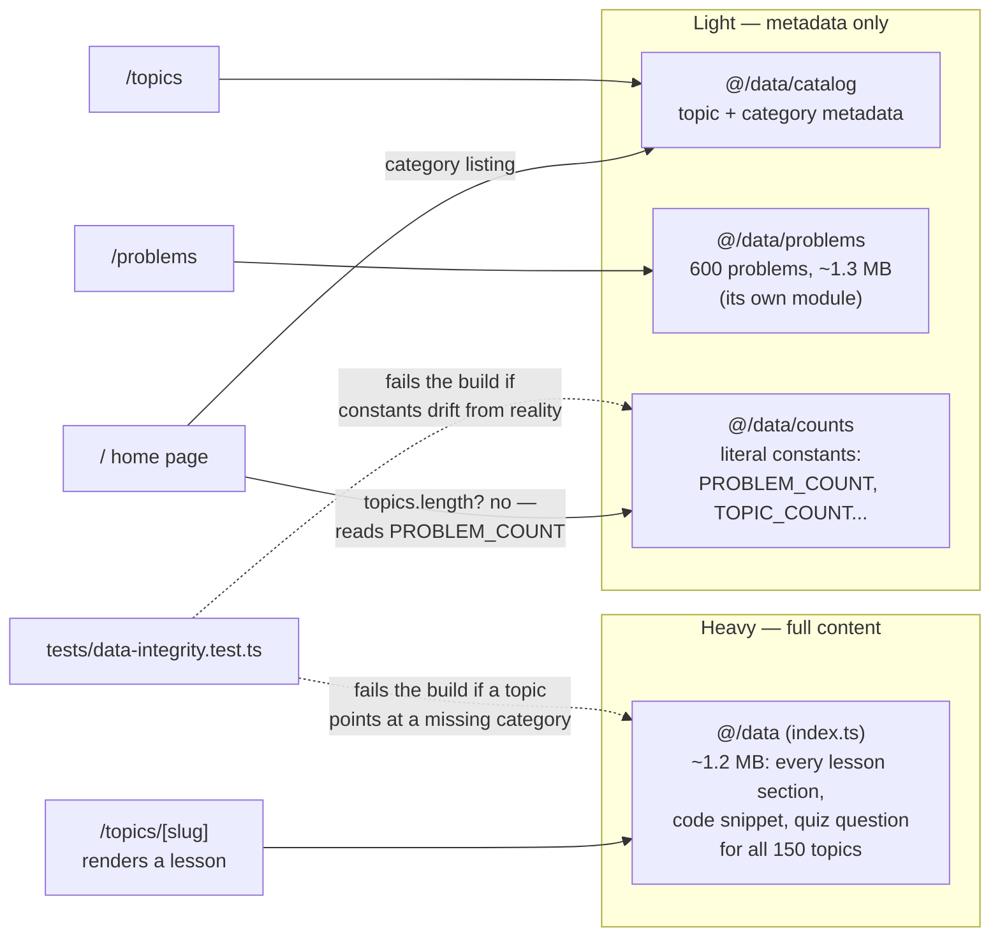
```mermaid
flowchart LR
    subgraph Heavy["Heavy — full content"]
        Barrel["@/data (index.ts)<br/>~1.2 MB: every lesson section,<br/>code snippet, quiz question<br/>for all 150 topics"]
    end
    subgraph Light["Light — metadata only"]
        Catalog["@/data/catalog<br/>topic + category metadata"]
        Problems["@/data/problems<br/>600 problems, ~1.3 MB<br/>(its own module)"]
        Counts["@/data/counts<br/>literal constants:<br/>PROBLEM_COUNT, TOPIC_COUNT..."]
    end

    Home["/ home page"] -->|"topics.length? no —<br/>reads PROBLEM_COUNT"| Counts
    Home -->|"category listing"| Catalog
    TopicsIndex["/topics"] --> Catalog
    TopicSlug["/topics/[slug]<br/>renders a lesson"] --> Barrel
    ProblemsArena["/problems"] --> Problems
    Integrity["tests/data-integrity.test.ts"] -.->|"fails the build if<br/>constants drift from reality"| Counts
    Integrity -.->|"fails the build if a topic<br/>points at a missing category"| Barrel
```

`src/data/index.ts` is a barrel that builds the full curriculum content
maps — every lesson section, code snippet, and quiz question for all 150
topics — **at module scope**. That's necessary for the topic and quiz pages,
which render that content. It was a problem for every *other* page, because a
static import of `topics` from the barrel pulled the entire curriculum along
with it: the home page, which only ever needed `topics.length`, was shipping
~1.2 MB of lesson prose just to display the number 150.

The fix is a light module, `src/data/catalog.ts`, holding only what a listing
needs — topic and category metadata, no lesson content. `src/data/problems.ts`
does the same for the 1.3 MB problem set, and `src/data/counts.ts` holds
literal count constants for pages that display a number and never render the
underlying rows.

The literal constants are the part that could silently drift, so
`tests/data-integrity.test.ts` loads the real data and **fails the build** if
`PROBLEM_COUNT`, `TOPIC_COUNT`, or `CATEGORY_COUNT` disagree with reality, and
separately checks referential integrity — every topic's `category_id`
resolves to a real category, no duplicate slugs or problem ids, every quiz has
a non-empty question list. That last check caught a real, pre-existing bug:
`CATEGORY_IDS.foundations` was referenced by 35 topics in the expanded
curriculum but never registered in the `categories` array, so an entire
category — Big-O notation, recursion trees, logarithms, two's complement —
was orphaned and rendered in **no category listing anywhere in the app**.

> **Rule of thumb for new code:** import from `@/data/catalog` for anything
> that lists or links topics; import from `@/data` only where a lesson,
> snippet, or quiz is actually rendered.

---

### State & Persistence

`src/lib/store.ts` is a single Zustand store, persisted to `localStorage`
under namespaced keys (`dsa_profile`, `dsa_completed_lessons`, `dsa_completed_
problems`, …) rather than through Zustand's `persist` middleware, because
different actions need different write timing — e.g. completing a lesson has
to update the streak and run achievement evaluation in the same tick, which a
generic persist middleware doesn't know how to sequence.

The app is **offline-first**: `isOffline` is derived once at boot from
whether `NEXT_PUBLIC_SUPABASE_URL`/`NEXT_PUBLIC_SUPABASE_ANON_KEY` are set.
Without them, every store action that would otherwise call Supabase writes to
`localStorage` only. This isn't a fallback path bolted onto a cloud-first
design — it's the default local-dev path, exercised every time someone clones
the repo without configuring credentials.

A flat XP award (`PROBLEM_COMPLETION_XP`) is granted by
`toggleProblemCompletion` the moment a problem transitions from incomplete to
complete, alongside a streak update and an activity record — that one action
is the single source of truth for "this problem is done," and every other
reward path (the mock interview's difficulty-weighted scoring, for one) has to
explicitly account for XP that path already granted rather than awarding on
top of it. This was a real, shipped bug — the interview session originally
called both — caught and fixed in code review; see
[docs/ARCHITECTURE.md](./docs/ARCHITECTURE.md) for the fix.

Feature-specific state that doesn't need to be global lives in its own small
module next to the store rather than being folded into it — see
`src/lib/daily-challenges.ts` and `src/lib/interview-session.ts`. Both read
and write their own `localStorage` keys and call back into the store only for
the side effects that are genuinely global (XP, streaks, problem completion).

---

### Testing Strategy

| File | What it protects | Cases |
|---|---|---|
| `tests/tracer.test.ts` | The tracer engine's correctness invariants — see [above](#the-tracer-engine) | 55 |
| `tests/data-integrity.test.ts` | The catalog/content split staying in sync, referential integrity of the curriculum data | 12 |
| `tests/interview-session.test.ts` | The mock-interview session engine — weighted selection, deterministic-under-seed, graceful degradation, scoring | 20 |

**87 tests total.** Vitest, not the project's original hand-rolled `node:test`
runner (`tests/dsa-logic.test.js`, deleted) — that file both tested a third
copy of the sorting algorithms rather than the shipped code, and had no
coverage reporting or CI integration.

```bash
npm test              # vitest run
npm run test:watch    # vitest, watch mode
npm run test:coverage # v8 coverage, 70% threshold gate on src/lib/**
```

Coverage deliberately excludes the QuickJS worker and the Supabase client —
both are thin wrappers around external systems better verified by
integration/manual testing than unit coverage.

---

### Performance Budget

Measured against a **production build** (`next build && next start`),
summing actual JS transferred up to `loadEventEnd` in a real browser — not
file sizes on disk, which undercounts what actually loads a page.

| | Before | After | Change |
|---|---:|---:|---:|
| Home page JS | 3356 KB | 1211 KB | **−64%** |
| Total JS on disk | 6.35 MB | 4.67 MB | −26% |

Four contributors, largest first:

1. **The `@/data` barrel** — see [Data Layer](#data-layer-catalog-vs-content)
   above. The single largest cause: pages that never needed the curriculum
   content were paying for it anyway.
2. **Decorative WebGL.** three.js + `@react-three/fiber` + `drei` cost
   **883 KB** to draw an ambient backdrop rendered at 12% opacity. The
   components already declined to render for `prefers-reduced-motion` and
   narrow viewports — but only *after* the bundle had downloaded and parsed,
   so the users most in need of the saving paid the full cost anyway.
   Replaced with blurred CSS radial gradients and an inline SVG motif:
   compositor-only, no render loop, renders during SSR, honours
   `prefers-reduced-motion` in CSS before first paint. Three dependencies
   removed entirely.
3. **KaTeX**, ~260 KB, was a static import — every route rendering any
   markdown paid for the LaTeX typesetter, including problem descriptions
   that contain no math at all. Now dynamically imported only when the
   content actually contains a `$`.
4. **Link prefetching.** Listing pages rendering hundreds of topic links were
   triggering Next's default hover/viewport prefetch for every one, each
   pulling the shared curriculum chunk. `prefetch={false}` on listing links.

```bash
npm run budget   # scripts/check-bundle-budget.mjs — fails CI on regression
```

The script sums every chunk under `.next/static/chunks` and fails if the
total or the single largest chunk exceeds a budget set just above current
size. A budget with generous headroom permits exactly the drift it exists to
prevent — it's meant to be raised deliberately, in a commit that explains
what earned the increase, not padded in advance.

---

### Accessibility

Baseline before this work: ~29 `aria-*` attributes across the entire
codebase, no keyboard navigation in the one component that's keyboard-first
by design (the ⌘K command palette), no `aria-live` region on the visualizer's
step narration — the *only* accessible description of what an algorithm is
doing, since the bars and highlighted cells it describes are unreadable to a
screen reader — and six form fields whose visible `<label>` text wasn't
programmatically associated with its input.

- **`MotionConfig reducedMotion="user"`** in the root layout makes every
  `motion.*` component in the tree honour `prefers-reduced-motion`
  automatically — one switch covering ~40 components that don't check
  `useReducedMotion()` individually.
- **Focus management on route change.** A client-routed `<Link>` navigation
  never reloads the document, so focus stays on the link just clicked — now
  pointing at a page the user has left. `PageTransition` moves focus to the
  new page's heading after every navigation.
- **The arena colour palette is [Okabe–Ito](https://jfly.uni-koeln.de/color/)**,
  chosen specifically because it stays distinguishable under protanopia,
  deuteranopia, and tritanopia — the palette it replaced used a red/green
  pairing for swap-vs-sorted state indistinguishable to roughly 1 in 12 men.
  Every accent/state colour pair in both themes was checked against WCAG AA
  contrast **programmatically** (computing relative luminance from the
  rendered CSS custom properties in a live browser), not eyeballed.
- **Command palette**: real arrow-key navigation with `aria-activedescendant`,
  a focus trap so `Tab` can't escape the open dialog into background content,
  and scroll-into-view so the keyboard highlight can't move off-screen
  unseen — all added after a review pass found the palette declared
  `aria-modal="true"` while implementing none of what that promises.

`AnimatePresence mode="wait"` bit this codebase twice during development, in
two different ways, and both times the fix was to stop using it — see the
[full write-up](./docs/ARCHITECTURE.md#accessibility) for the specifics
(worth reading before touching any multi-step transition in this codebase).

---

### CI/CD

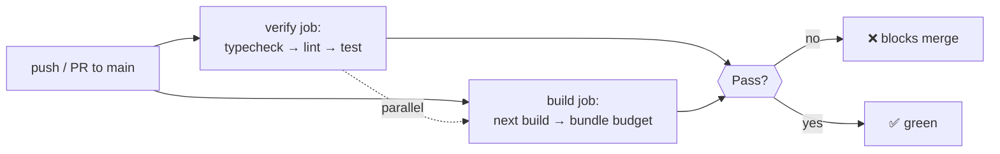
```mermaid
flowchart LR
    Push["push / PR to main"] --> Verify["verify job:<br/>typecheck → lint → test"]
    Push --> Build["build job:<br/>next build → bundle budget"]
    Verify -.->|"parallel"| Build
    Verify --> Pass{{"Pass?"}}
    Build --> Pass
    Pass -->|no| Fail["❌ blocks merge"]
    Pass -->|yes| Green["✅ green"]
```

`.github/workflows/ci.yml` runs two jobs on every push and PR: **verify**
(typecheck → lint → test, in that order so a trivial break fails in seconds
rather than after a full production build) and **build** (production build,
then the bundle budget check). Both run in parallel; a newer push to the same
branch cancels the in-flight run for it.

---

## Feature Tour

Screenshots below are captured live from **[dsa-house.vercel.app](https://dsa-house.vercel.app)**.

<details open>
<summary><strong>Home & Learning Roadmap</strong></summary>
<br>

| Landing Page | Learning Roadmap |
|---|---|
| 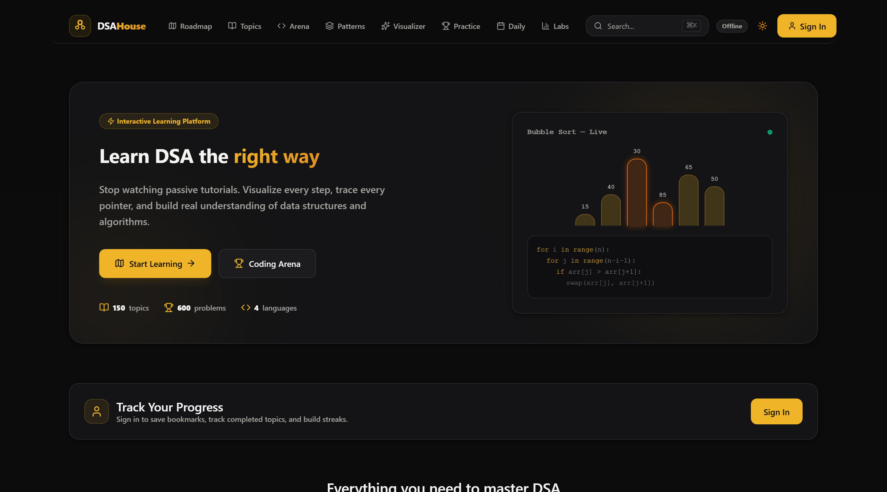 | 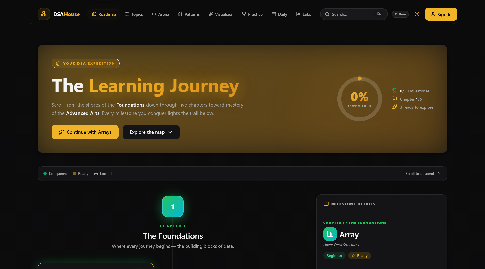 |

</details>

<details>
<summary><strong>Algorithm Visualizers</strong> — 16 sandboxes, all driven by the tracer engine above</summary>
<br>

| Binary Search (discard-dimming) | Quick Sort (pivot highlighting) |
|---|---|
| 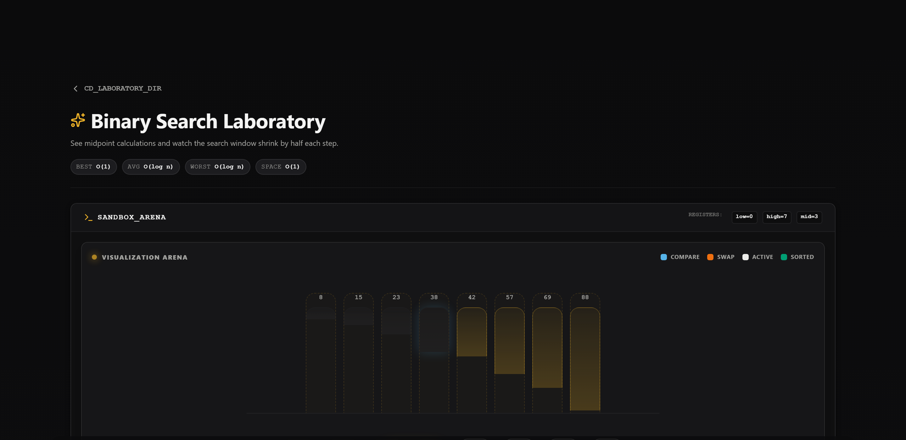 | 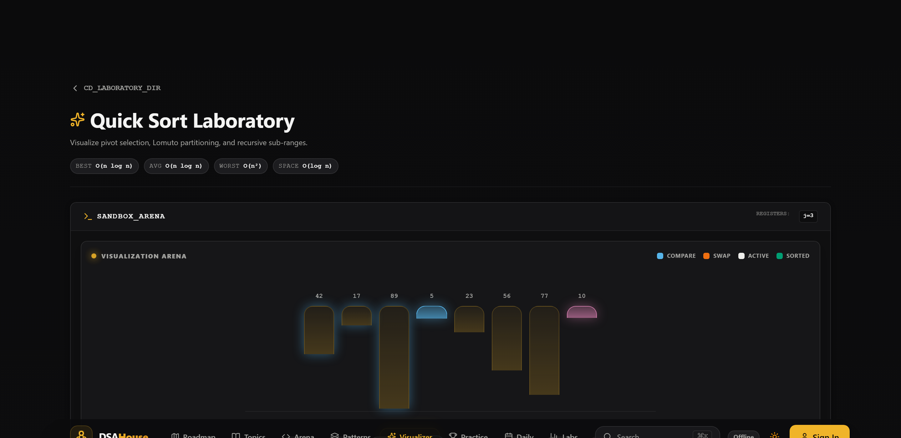 |

| Merge Sort | Graph BFS |
|---|---|
| 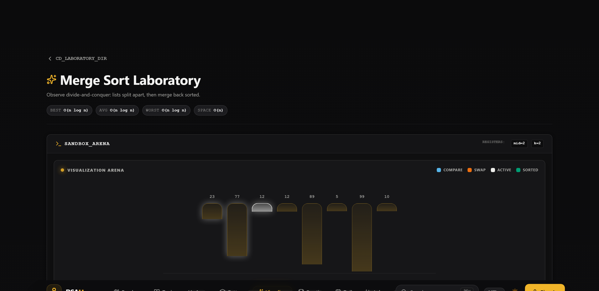 | 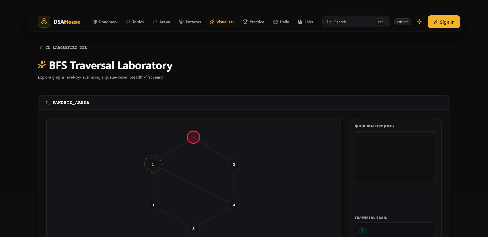 |

</details>

<details>
<summary><strong>Coding Arena</strong> — in-browser code execution via a sandboxed QuickJS worker</summary>
<br>

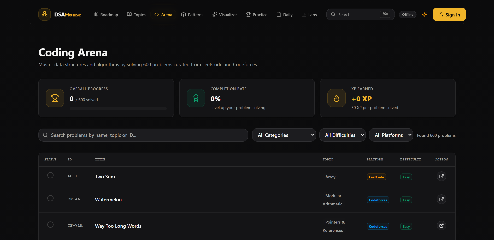

</details>

<details>
<summary><strong>Mock Interview Mode</strong> — timed sessions, difficulty-weighted scoring, a rubric report</summary>
<br>

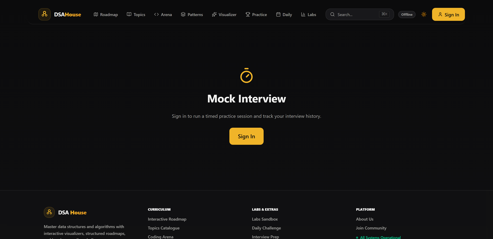

</details>

<details>
<summary><strong>Dashboard, Practice & More</strong></summary>
<br>

| Progress Dashboard | Interactive Quizzes |
|---|---|
| 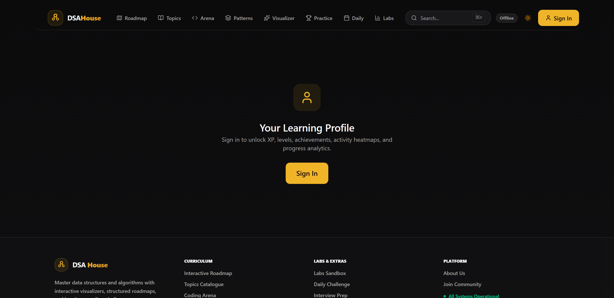 | 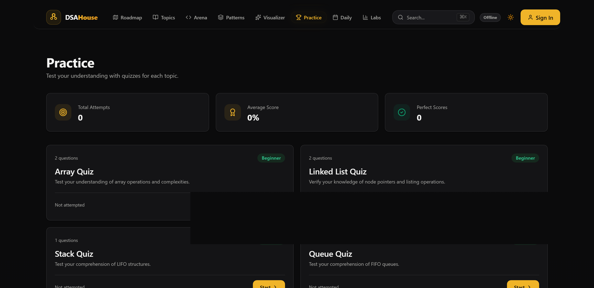 |

</details>

---

## Tech Stack

### Frontend & Rendering
- **[Next.js 16](https://nextjs.org/)** (App Router) — Turbopack bundler
- **[React 19](https://react.dev/)**
- **[Tailwind CSS v4](https://tailwindcss.com/)** — token-based design system (see [Accessibility](#accessibility) for the colour-contrast methodology)
- **[Framer Motion](https://www.framer.com/motion/)** — transitions and interaction feedback
- **[KaTeX](https://katex.org/)** — dynamically loaded only when content contains math

### Data & State
- **[Zustand](https://github.com/pmndrs/zustand)** — persisted to namespaced `localStorage` keys
- **[Supabase](https://supabase.com/)** (optional) — Postgres + RLS + anonymous auth for cloud progress sync
- **[quickjs-emscripten](https://github.com/justjake/quickjs-emscripten)** — sandboxed in-browser Python/JS execution for the coding arena, isolated in a Web Worker

### Testing & CI
- **[Vitest](https://vitest.dev/)** — 87 tests, `@vitest/coverage-v8` for coverage
- **[Playwright](https://playwright.dev/)** — screenshot capture tooling (`scripts/capture-screenshots.mjs`)
- **GitHub Actions** — typecheck → lint → test → build → bundle-budget on every push

---

## Project Structure

```
DSA House/
├── docs/
│   └── ARCHITECTURE.md       # Full design-decision write-up
├── tests/                    # Vitest suites (87 tests)
├── .github/workflows/        # CI pipeline
├── scripts/
│   ├── check-bundle-budget.mjs
│   └── capture-screenshots.mjs
├── assets/screenshots/       # Feature-tour images (captured from the live deploy)
├── src/
│   ├── app/                  # Next.js App Router pages
│   │   ├── visualizer/       # Step-playback visualizer sandboxes
│   │   ├── topics/           # Curriculum topics and lessons
│   │   ├── problems/         # Coding arena / problem workspace
│   │   ├── interview/        # Timed mock-interview sessions
│   │   ├── roadmap/          # Skill-tree learning path
│   │   ├── labs/             # Complexity estimators, sandboxes
│   │   └── dashboard/        # XP, streaks, bookmarks
│   ├── components/
│   │   ├── layout/           # Navbar, Footer, PageTransition, StoreInitializer
│   │   ├── visualizers/      # Visualizer renderers (consume src/lib/trace)
│   │   └── runner/           # CodeRunner (QuickJS-backed)
│   ├── lib/
│   │   ├── trace/            # ★ The instrumented algorithm tracer engine
│   │   │   ├── tracer.ts     # Instrumentation core
│   │   │   ├── types.ts      # Tracer/TracedArray API surface
│   │   │   ├── index.ts      # Public exports + legacy adapter
│   │   │   └── algorithms/   # sorting.ts, searching.ts
│   │   ├── runner/           # Sandboxed code execution client/worker
│   │   ├── interview-session.ts
│   │   ├── daily-challenges.ts
│   │   └── store.ts          # Zustand store
│   ├── data/
│   │   ├── catalog.ts        # ★ Light topic/category metadata (no lesson content)
│   │   ├── problems.ts       # Full problem set (imported only where rendered)
│   │   ├── counts.ts         # Cheap count constants for listing pages
│   │   ├── index.ts          # Heavy barrel: full lesson/snippet/quiz content
│   │   └── curriculum/       # Authored lesson content, per topic
│   └── types/
└── supabase/
    └── schema.sql             # Database schema & RLS policies
```

---

## Getting Started

### 1. Installation
Requires **Node.js 18.17+**.
```bash
git clone https://github.com/Tanvir284/Dsa-house.git
cd Dsa-house
npm install
```

### 2. Environment Variables (optional)
The app runs fully offline out of the box. To connect Supabase for cloud
progress sync:
```bash
cp .env.example .env.local
```
```env
NEXT_PUBLIC_SUPABASE_URL=your-supabase-url
NEXT_PUBLIC_SUPABASE_ANON_KEY=your-anon-key
```

### 3. Run
```bash
npm run dev
```
Open [http://localhost:3000](http://localhost:3000).

### 4. Verify
```bash
npm run typecheck   # tsc --noEmit
npm run lint
npm test            # vitest run — 87 tests
npm run build        # production build
npm run budget       # bundle-size check against .next/static/chunks
```

### Offline-first

No `.env.local` is required for local development. Every store action that
would otherwise write to Supabase (profile updates, completions, XP) writes
to `localStorage` instead — `isOffline` is derived once at boot from whether
the Supabase environment variables are set. See
[State & Persistence](#state--persistence).

---

## License & Author

[MIT](./LICENSE)

**Md Tanvir Islam**
- GitHub: [@Tanvir284](https://github.com/Tanvir284)
- Live App: [dsa-house.vercel.app](https://dsa-house.vercel.app)

For the full write-up of every architectural trade-off summarized above,
including the ones that turned into bug reports, see
**[docs/ARCHITECTURE.md](./docs/ARCHITECTURE.md)**.
