<div align="center">

# DSA House

### An interactive platform for learning data structures & algorithms

**150 topics · 16 algorithm visualizers · 600 coding problems · Timed mock interviews · Offline-first**

[](./.github/workflows/ci.yml)
[](https://nextjs.org/)
[](https://react.dev/)
[](https://www.typescriptlang.org/)
[](https://tailwindcss.com/)
[](https://vitest.dev/)
[](./LICENSE)

<a href="https://dsa-house.vercel.app">Live Demo</a> ·
<a href="#getting-started">Quick Start</a> ·
<a href="./docs/ARCHITECTURE.md">Architecture</a> ·
<a href="#feature-tour">Feature Tour</a>

</div>

---

## Overview

DSA House is a full-stack learning platform for data structures and
algorithms: structured curriculum, step-through algorithm visualizers, a
LeetCode-style coding arena with in-browser code execution, and a timed
mock-interview mode.

Built with **Next.js 16 (App Router) + React 19 + Tailwind v4 + Zustand**, and
engineered **offline-first** — without Supabase credentials configured, the
app falls back to `localStorage` for all progress, XP, and session state, so
it's fully usable with zero backend setup.

Beyond the feature set, the parts of this codebase worth a closer look:

- **[An instrumented algorithm tracer](./docs/ARCHITECTURE.md#the-tracer-engine)**
  replacing hand-written per-algorithm step generators — each algorithm is
  written once, as real code, and the visualization (including a live
  recursion call stack and measured operation counts) falls out of actually
  running it. 55 property-based tests assert invariants — permutation
  preservation, valid transpositions, monotonic counters — that apply to
  every algorithm in the registry automatically.
- **A [performance budget](./docs/ARCHITECTURE.md#performance-budget)** enforced
  in CI: home-page JS cut from 3.36 MB to 1.21 MB (measured in a real browser,
  not estimated from disk size), with a script that fails the build if it
  regresses.
- **An [accessibility pass](./docs/ARCHITECTURE.md#accessibility)** covering
  keyboard navigation, screen-reader narration of the visualizer arena, focus
  management across client-side route changes, and a colorblind-safe
  (Okabe–Ito) palette for the algorithm-state colors that actually teach
  something.
- **[CI](./.github/workflows/ci.yml)** gating every push on typecheck, lint,
  test, build, and the bundle budget.

See **[docs/ARCHITECTURE.md](./docs/ARCHITECTURE.md)** for the full write-up
of these decisions and the trade-offs behind them.

---

## Feature Tour

<details>
<summary><strong>10 screenshots — click to expand</strong></summary>

### Interactive Learning Roadmap
A skill-tree roadmap showing prerequisites, topic status, and a guided path through the curriculum.
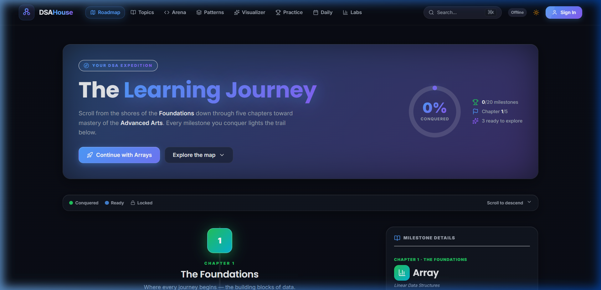

### Gamified Progress Dashboard
Streaks, XP, completed tracks, quiz history, and bookmarks in one profile view.
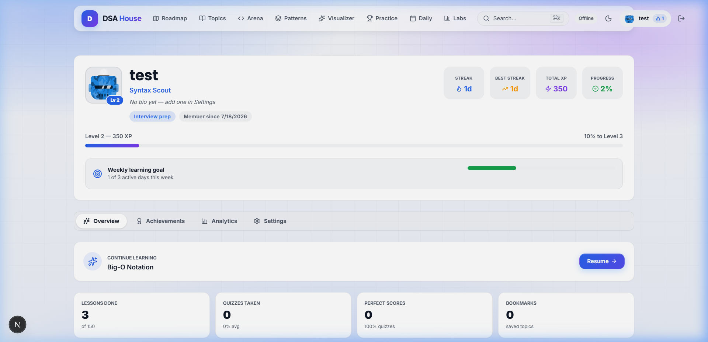

### LeetCode-Style Coding Arena
An IDE-style workspace with problem descriptions, multi-language solutions, constraints, and complexity notes.
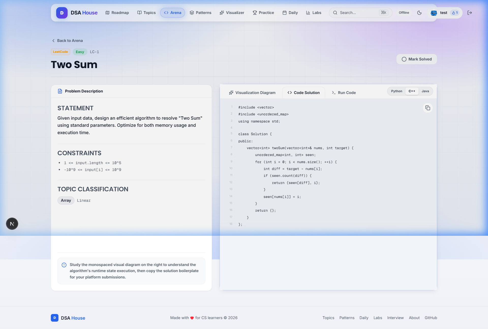

### Sorting Performance Race
Bubble, insertion, merge, and quick sort run side-by-side on the same input, with live comparison and swap counts.
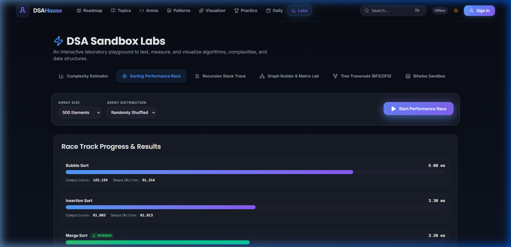

### Step-by-Step Algorithm Visualizers
16 visualizers — sorting, searching, trees, graphs, and linear structures — with scrubbable playback, live operation counters, and (for recursive algorithms) a real call stack.
| Array Sorting Visualizer | Linked List Visualizer |
| --- | --- |
| 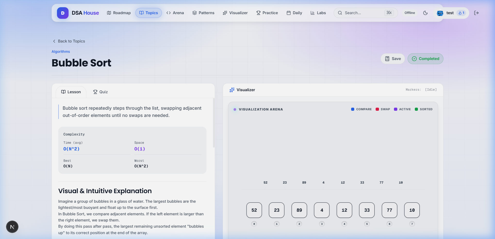 | 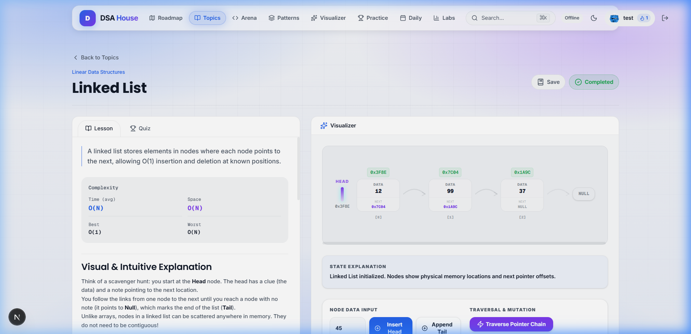 |

### Recursion Call Stack Trace
A debugger visualizing recursive calls as a live push/pop call hierarchy.
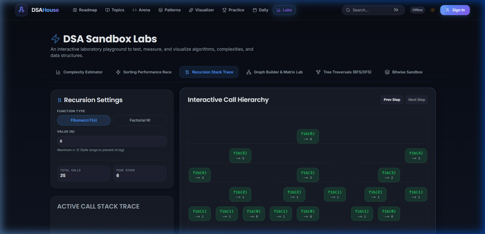

### Graph Builder & Matrix Lab
Build a graph and see it mirrored across adjacency matrix and adjacency list representations in real time.
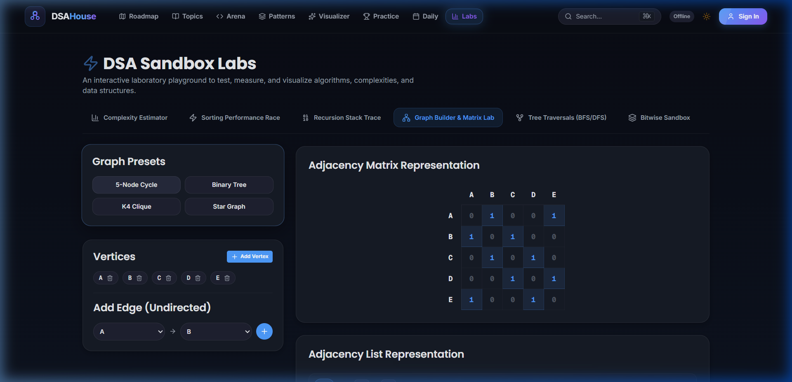

### Tree Traversals Simulator (BFS vs DFS)
A queue/stack step debugger for breadth-first and depth-first (pre/in/post) traversals.
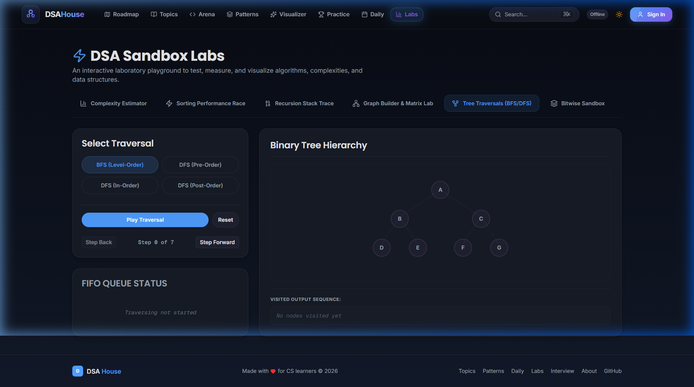

### Bitwise Operations Sandbox
An 8-bit register interface with live binary/decimal readouts and bit-shift simulation.
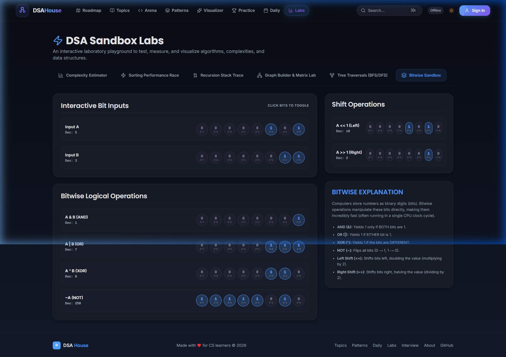

### Interactive Quizzes & Assessment Engine
Topic-based quizzes with instant feedback, explanations, and XP rewards.
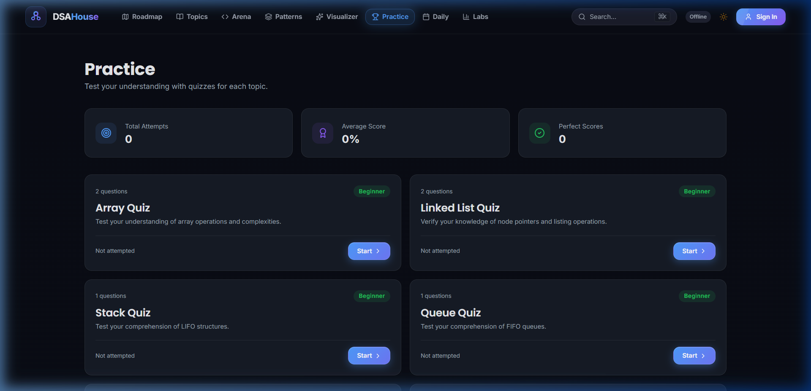

</details>

---

## Technical Stack

### Frontend & Rendering
- **Next.js 16 (App Router)** — Turbopack bundler, App Router.
- **React 19**
- **Tailwind CSS v4** — token-based design system in `globals.css` (see the [colorblind-safe palette write-up](./docs/ARCHITECTURE.md#accessibility)).
- **Framer Motion** — transitions and interaction feedback; `MotionConfig reducedMotion="user"` makes the whole tree honor `prefers-reduced-motion` from one place.
- **KaTeX** — dynamically loaded only when content actually contains math.

### Data & State
- **Zustand**, persisted to namespaced `localStorage` keys rather than a generic persist middleware, since several actions (e.g. completing a lesson) need to sequence multiple pieces of state in one tick.
- **Supabase** (optional) — Postgres + RLS + anonymous auth for cloud progress sync. Entirely optional: see [Offline-first](#offline-first).
- **QuickJS (via `quickjs-emscripten`)** — sandboxed in-browser Python/JS execution for the coding arena's runner, isolated in a Web Worker.

### Testing & CI
- **Vitest** — 82 tests across the tracer engine, data integrity, and the mock-interview session engine. `npm run test:coverage` for coverage (70% threshold gate on `src/lib/**`).
- **GitHub Actions** — typecheck → lint → test → build → bundle-budget on every push. See [`.github/workflows/ci.yml`](./.github/workflows/ci.yml).

---

## Project Structure

```
DSA House/
├── docs/
│   └── ARCHITECTURE.md       # Design decisions and trade-offs
├── tests/                    # Vitest suites
├── .github/workflows/        # CI pipeline
├── scripts/
│   └── check-bundle-budget.mjs
├── assets/screenshots/
├── src/
│   ├── app/                  # Next.js App Router pages
│   │   ├── visualizer/       # Step-playback visualizer sandboxes
│   │   ├── topics/           # Curriculum topics and lessons
│   │   ├── problems/         # Coding arena / problem workspace
│   │   ├── interview/        # Timed mock-interview sessions
│   │   ├── roadmap/          # Skill-tree learning path
│   │   ├── labs/             # Complexity estimators, sandboxes
│   │   └── dashboard/        # XP, streaks, bookmarks
│   ├── components/
│   │   ├── layout/           # Navbar, Footer, PageTransition, StoreInitializer
│   │   ├── visualizers/      # Visualizer renderers (consume src/lib/trace)
│   │   └── runner/           # CodeRunner (QuickJS-backed)
│   ├── lib/
│   │   ├── trace/            # The instrumented algorithm tracer engine
│   │   ├── runner/           # Sandboxed code execution client/worker
│   │   ├── interview-session.ts
│   │   ├── daily-challenges.ts
│   │   └── store.ts          # Zustand store
│   ├── data/
│   │   ├── catalog.ts        # Light topic/category metadata (no lesson content)
│   │   ├── problems.ts       # Full problem set (imported only where rendered)
│   │   ├── counts.ts         # Cheap count constants for listing pages
│   │   └── curriculum/       # Full lesson content, snippets, quizzes
│   └── types/
└── supabase/
    └── schema.sql             # Database schema & RLS policies
```

---

## Getting Started

### 1. Installation
Requires **Node.js 18.17+**.
```bash
git clone https://github.com/Tanvir284/Dsa-house.git
cd Dsa-house
npm install
```

### 2. Environment Variables (optional)
The app runs fully offline out of the box. To connect Supabase for cloud
progress sync:
```bash
cp .env.example .env.local
```
```env
NEXT_PUBLIC_SUPABASE_URL=your-supabase-url
NEXT_PUBLIC_SUPABASE_ANON_KEY=your-anon-key
```

### 3. Run
```bash
npm run dev
```
Open [http://localhost:3000](http://localhost:3000).

### 4. Verify
```bash
npm run typecheck   # tsc --noEmit
npm run lint
npm test            # vitest run
npm run build        # production build
npm run budget       # bundle-size check against .next/static/chunks
```

### Offline-first

No `.env.local` is required. Every store action that would otherwise write
to Supabase (profile updates, completions, XP) writes to `localStorage`
instead — `isOffline` is derived once at boot from whether the Supabase
environment variables are set. This is the default local-dev path, not a
fallback bolted onto a cloud-first design.

---

## License
[MIT](./LICENSE)

## Author
**Md Tanvir Islam**
- GitHub: [@Tanvir284](https://github.com/Tanvir284)
- Live App: [dsa-house.vercel.app](https://dsa-house.vercel.app)
